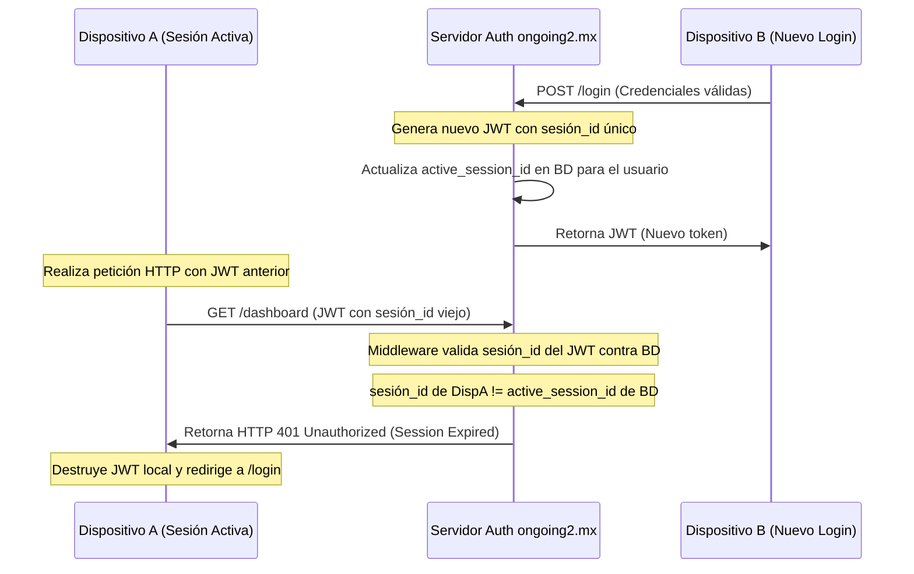

# Especificaciones de Sincronización y Reglas de Negocio (ERP Sync)

Este documento detalla las reglas de negocio críticas y la lógica de integración para el ecosistema entre la landing page (`ongoing.mx`) y la aplicación web multi-tenant (`ongoing2.mx`).

---

## 1. Reglas de Negocio del Plan Gratuito (1 Usuario)

El Plan Gratuito está diseñado para permitir el uso permanente de la plataforma para un único administrador.

* **Duración:** De por vida (permanente).
* **Límite de Licencias:** Máximo 1 usuario activo registrado en el tenant.
* **Flujo de Bloqueo/Paywall:**
  1. El sistema registra la cantidad de usuarios activos en el tenant.
  2. En cada petición al API o al intentar dar de alta un nuevo usuario, se ejecuta un middleware que evalúa si el número total de usuarios activos excede 1.
  3. Si el tenant intenta activar a un segundo usuario o más, el sistema requiere la contratación de licencias y cambia el estado de acceso para exigir suscripción de pago comercial.

---

## 2. Redirección Perimetral de Facturación (Paywall)

Para asegurar que un cliente inactivo no consuma recursos, se implementa una redirección forzada a nivel de cliente y servidor.

* **Flujo del Middleware (Backend):**
  * Toda solicitud a rutas protegidas (excepto APIs de `/billing/*` y `/logout`) es interceptada por el middleware de suscripción activa.
  * Si el tenant tiene estado `expired`, el backend retorna un código de error HTTP `402 Payment Required` junto con el JSON: `{"error": "subscription_expired", "redirect_url": "/billing/paywall"}`.
* **Comportamiento en Frontend (SPA/Client):**
  * El cliente intercepta respuestas HTTP `402`.
  * Realiza una redirección forzada perimetral a `/billing/paywall` mediante `window.location.href = "/billing/paywall"`.
  * La interfaz del paywall se bloquea impidiendo cualquier interacción o navegación lateral.

---

## 3. Control Anti-Piratería (Sesión Única Activa)

Para evitar el uso compartido de cuentas individuales, se implementa un control estricto de sesión única por usuario administrador/operador.

* **Lógica del Token JWT:**
  * Al hacer login en el Dispositivo B, el servidor genera un identificador de sesión único (`session_uuid`) y lo guarda en el payload del JWT de B, actualizándolo simultáneamente en el registro del usuario en la base de datos (`active_session_id`).
  * Cuando el Dispositivo A intenta realizar cualquier llamada con su token anterior, el middleware del servidor compara el `session_uuid` del token de A con el `active_session_id` almacenado.
  * Al no coincidir, el servidor invalida la petición con un estado HTTP `401 Unauthorized`. El cliente del Dispositivo A destruye el token guardado en `localStorage/sessionStorage` y redirige al usuario a `/login` con un mensaje de "Sesión cerrada por inicio en otro dispositivo".

---

## 4. Integración de Mercado Pago Checkout Pro (Pasarela Dual)

Para garantizar que no se pierdan transacciones debido a fallos de red en el navegador del cliente, se implementa un esquema de validación síncrono/asíncrono.

### A. Flujo de Redirección Síncrona (Éxito del Cliente)
1. Al completar el pago en la ventana del Checkout Pro, el usuario es redirigido a `https://ongoing2.mx/billing/callback?status=approved&payment_id=123...`.
2. El frontend de la aplicación web muestra una pantalla de procesamiento y hace un llamado al API `/api/billing/verify-payment` enviando el `payment_id`.
3. El servidor consulta a la API oficial de Mercado Pago para verificar el estado de la transacción. Si es aprobada, reactiva el tenant y el frontend redirige al dashboard.

### B. Webhook Asíncrono de Respaldo (IPN - Instant Payment Notification)
1. En paralelo, en el momento del pago, Mercado Pago envía un webhook asíncrono (POST) al endpoint de respaldo `/api/webhooks/mercadopago`.
2. El servidor valida la firma del webhook para evitar falsificaciones.
3. El backend realiza la llamada interna a la API de Mercado Pago para confirmar el estatus de la orden.
4. Si la orden está aprobada, se ejecuta el proceso de reactivación en la base de datos (cambiando el estatus de `expired` a `active`).
5. **Previsión de Colisión:** El servidor implementa bloqueos optimistas (locks por base de datos o Redis) utilizando el `payment_id` como clave única para evitar que el callback síncrono del cliente y el webhook asíncrono dupliquen la reactivación o generen registros de facturación redundantes.
